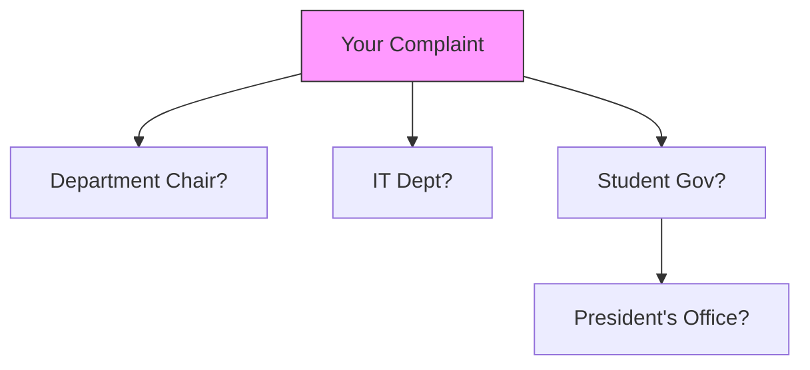

Here's the exact content to copy/paste into a Google Doc, formatted for immediate use with headers, bullet points, and hyperlinks:

---

# **Liberatory Feedback Systems: A Student Builder's Guide**  
*How to Audit, Rebuild & Demand Better Campus Tech*  

---

## **1. Introduction**  
Tech isn't neutral. This guide helps you transform feedback systems from extraction tools to liberation tools – whether you're redesigning course evals, campus apps, or reporting systems. No coding experience needed!  

**Key Principles:**  
- 🔍 **Power-aware design** (Who benefits? Who's harmed?)  
- 🛡 **Safety-first infrastructure** (Protect marginalized voices)  
- 🔄 **Collective maintenance** (Avoid "build it and abandon it")  

---

## **2. Power-Mapping Exercise**  

### **Step 1: Audit Existing Tech**  
Pick a campus system (e.g., course evals, bias reporting). Ask:  
- 🤔 *Who designed this? Who gets to change it?*  
- 😡 *What harms have occurred? (e.g., international students afraid to report bias)*  

### **Step 2: Map Decision-Makers**  

**Template:**  
*"At our school, [X system] is controlled by ______. To change it, we must pressure ______."*  

---

## **3. Liberatory Toolstack**  

| Purpose           | Corporate Tool | Liberatory Alternative                      |
| ----------------- | -------------- | ------------------------------------------- |
| Surveys           | Google Forms   | [CryptPad Forms](https://cryptpad.fr/form/) |
| Decisions         | Slack polls    | [Loomio](https://www.loomio.com/)           |
| Anonymous Reports | Qualtrics      | [OnionShare](https://onionshare.org/)       |

**Tip:** *Use "tech triangles" – pair digital tools with in-person circles for accountability.*  

---

## **4. Prototyping Prompts**  
Try designing:  
- 📢 A **bias reporting tool** where:  
  - Reports auto-aggregate into public dashboards (*but*)  
  - Submitters choose anonymity levels  
- 🗳 A **course eval system** co-designed with adjunct faculty  

**Template:**  
*"Our tool will prioritize ______ [e.g., transparency] by ______ [e.g., showing how data is used]."*  

---

## **5. Demand Change**  

### **Script for IT Meetings:**  
*"We request:  
1. A student seat on the [X software] selection committee  
2. Pilot testing our prototype for [Y problem]  
3. Budget for ethical alternatives (see Section 3)"*  

### **Petition Template:**  
*"We, the undersigned, demand ______ because ______. Signed: ______."*  

---

## **6. Sustain the Work**  

### **Maintenance Rota Example:**  
| Week | Tasks                  | Who     |
|------|------------------------|---------|
| 1    | Review feedback reports | Team A  |
| 2    | Update FAQ doc          | Team B  |

### **Micro-Grant Sources:**  
- Student government discretionary funds  
- [Mozilla Open Source Support](https://www.mozilla.org/en-US/moss/)  

---

## **How to Use This Guide**  
1. **Share with your team**: File > Share > "Anyone with link can view"  
2. **Adapt freely**: This work is licensed under [CC BY-SA 4.0](https://creativecommons.org/licenses/by-sa/4.0/)  
3. **Submit improvements**: Contribute via [Liberatory Lab GitHub](https://github.com/asiakay/liberate)  

---

**Preview this doc live**: [Click here to create your own copy](https://docs.new) *(Auto-generates a fresh Google Doc)*  

Let me know if you'd like:  
1. A version with **comments for facilitators**  
2. A **print-friendly PDF** version  
3. To add a specific **campus case study**